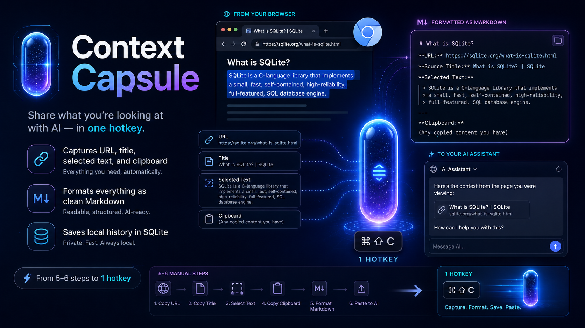

# Context Capsule

Context Capsule cuts the "share what I'm looking at with an AI" routine from a 5-6 step manual dance down to a single hotkey.

When you're debugging, researching, or working with an AI assistant, you constantly need to hand it context: which page you were on, what part of it matters, plus whatever you'd already copied. Right now that means selecting text, copying it, switching to your chat window, pasting it, going back to grab the URL, and then cleaning everything into a readable shape. If you accidentally copy something else before you paste, the original context is gone and you have to redo the whole thing.

Context Capsule captures the active Chromium page URL, title, selected text, and a clipboard fallback, formats it as markdown, copies it to your clipboard, and keeps a small local SQLite history.

More detailed docs live in [`docs/`](docs/README.md).



## Quality-of-Life Improvements

- One hotkey replaces the entire copy -> switch -> format -> paste routine. Capture happens instantly without leaving the page.
- Automatic clean formatting. Every capture comes out as a consistent markdown block with source link, title, and timestamp.
- A local history survives clipboard overwrites. If you copy something else before pasting, the capture is still one click from being back on your clipboard.
- Popup capture, visible status, and an install doctor make the demo path less fragile.

## Before and After

Before:

1. Select useful page text.
2. Copy it.
3. Switch to the AI chat.
4. Paste it.
5. Go back for the URL and title.
6. Clean up the context by hand.

After:

Press `Ctrl+Shift+C` on the page and paste this:

```markdown
> Source: [Page Title](https://example.com/page)
> Captured: 2026-06-20 14:32

Selected text or clipboard fallback, verbatim.
```

## Install

Context Capsule targets Chromium-based browsers only for now: Chrome, Edge, and Brave. Firefox is intentionally out of scope, but all browser-extension code is isolated in `extension/`.

1. Install Python dependencies:

   ```powershell
   python -m pip install -r requirements.txt
   ```

2. Register the native messaging host:

   ```powershell
   python install.py
   ```

   The installer derives the stable extension ID from `extension/manifest.json`, writes the native host manifest, creates a small launcher script, and registers Chrome, Edge, and Brave for the current user. It is idempotent and safe to run again.

3. Check the setup:

   ```powershell
   python install.py --doctor
   ```

   The doctor checks the Python dependency, clipboard access, host launcher, native host manifest, browser registration, and extension ID wiring. Its clipboard check temporarily copies a test token and then restores the prior clipboard contents.

4. Load the unpacked extension:

   - Open `chrome://extensions`, `edge://extensions`, or `brave://extensions`.
   - Enable Developer Mode.
   - Click "Load unpacked".
   - Select the `context-capsule/extension` folder.

5. Use it:

   - `Ctrl+Shift+C` captures the active page context.
   - `Ctrl+Shift+H` opens history.
   - Clicking the toolbar icon opens the popup dashboard.
   - The popup can capture the current page, switch capture modes, show summary counts, search/filter history, open saved source URLs, switch format presets, re-copy, pin, delete, or clear history entries.
   - The popup can also collect multiple captures into an active capsule and copy them as one combined markdown prompt.

On macOS, use `Command+Shift+C` and `Command+Shift+H`.

### Linux Clipboard Note

`pyperclip` needs a system clipboard helper on Linux. Install `xclip` or `xsel` first, otherwise clipboard reads and writes can fail silently outside Python's control.

Examples:

```bash
sudo apt install xclip
# or
sudo apt install xsel
```

## Native Messaging

The Chrome native host name is:

```text
com.context_capsule.host
```

Messages use Chrome Native Messaging's required 4-byte little-endian length prefix before each UTF-8 JSON payload. The extension sends small actions such as `capture`, `history`, `recopy`, `pin`, `delete`, and `clear`; formatting, SQLite storage, and clipboard work live in Python.

Reference: [Chrome Native Messaging documentation](https://developer.chrome.com/docs/extensions/develop/concepts/native-messaging).

## Data

History is stored locally at:

```text
context-capsule/data/history.sqlite3
```

The storage layer keeps the most recent 200 unpinned captures and the popup shows the latest 20 by default.

Pinned entries float to the top and are protected from automatic pruning. The explicit Clear button removes all saved captures after confirmation.

## Format Presets

- `Markdown`: the original blockquote source format.
- `Compact`: a shorter source and captured line.
- `Prompt`: a label-heavy format meant to paste directly into an LLM prompt.

The popup remembers the most recent preset and stores the preset name with each history entry.

## Capture Modes

- `Smart`: selected text with clipboard fallback.
- `Selection`: selected text only.
- `Clipboard`: current clipboard content with page source.
- `Page only`: page title and URL only.
- `Visible text`: readable text currently visible in the viewport.
- `Readable text`: cleaned text from the page's main/article/body content.

## Multi-Source Capsules

Use the popup's Capsule section to collect multiple captures before pasting into an AI chat:

- `Start`: creates a new active capsule.
- `Append Page`: captures the current page and adds it to the active capsule.
- `Copy`: copies all capsule items as one combined markdown prompt.
- `Clear`: removes the active capsule.

## Demo Page

Serve `demo.html` through Python's built-in local server for a controlled manual test page with selectable sample text and checklist prompts:

```powershell
python -m http.server 8765
```

Then open `http://localhost:8765/demo.html`. Serving over localhost avoids Chrome's extra file URL extension restrictions.

## Manual Test Checklist

- Select text on a normal webpage, press `Ctrl+Shift+C`, then paste somewhere. The clipboard should contain a markdown block with the page title, URL, timestamp, and selected text.
- Click into a page with no selected text, copy some fallback text manually, press `Ctrl+Shift+C`, then paste. The markdown body should contain the previous clipboard text.
- Press `Ctrl+Shift+H` or click the toolbar icon. The popup should show last capture status, summary counts, search/filter controls, and recent captures.
- Click "Capture Current Page" in the popup. It should perform the same capture as the hotkey.
- Switch each capture mode and capture once. The pasted output should match the selected mode.
- Click an older popup entry, then paste. That older markdown block should be copied back to the clipboard.
- Search history, filter pinned/fallback captures, and open a saved source URL from the popup.
- Pin, unpin, delete, and clear entries from the popup. The list should refresh after each action.
- Start a capsule, append two pages, copy it, and paste. The output should contain both captures.
- Switch each format preset and capture once. The pasted output should match the selected preset.
- Run `python install.py --doctor`. It should show PASS/FAIL rows for dependency, clipboard, host launch, manifest, and browser registration checks.
- Re-run `python install.py`. It should complete cleanly without manual JSON or registry edits.
